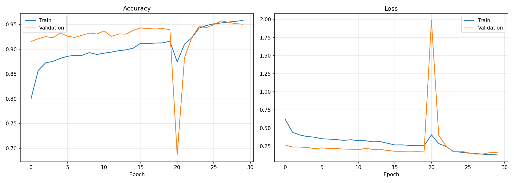

# 🛰️ EuroSAT Land Use Classification

<p align="center">
  
</p>

<p align="center">
  
  
  
  
  
  
  
</p>

---

## 📌 Description

Projet de **classification d'images satellitaires** basé sur le dataset **EuroSAT**, réalisé dans le cadre du **PFE — Licence d'excellence en Intelligence Artificielle** à la **Faculté des Sciences Ben M'Sik, Casablanca**.

Le modèle utilise **MobileNetV2** (Transfer Learning + Fine-Tuning) pour classifier des images Sentinel-2 en **10 catégories** d'occupation du sol avec une précision de **~93%**.

---

## 🗂️ Classes détectées

| # | Classe | Description | Emoji |
|---|--------|-------------|-------|
| 0 | AnnualCrop | Cultures annuelles | 🌾 |
| 1 | Forest | Forêts | 🌲 |
| 2 | HerbaceousVegetation | Végétation herbacée | 🌿 |
| 3 | Highway | Routes et autoroutes | 🛣️ |
| 4 | Industrial | Zones industrielles | 🏭 |
| 5 | Pasture | Pâturages | 🐄 |
| 6 | PermanentCrop | Cultures permanentes | 🫒 |
| 7 | Residential | Zones résidentielles | 🏘️ |
| 8 | River | Rivières | 🌊 |
| 9 | SeaLake | Mer et lacs | 🏖️ |

---

## 🏗️ Architecture du projet

```
agri_classification/
│
├── data/
│   └── EuroSAT/                    # Dataset (non inclus — voir section Dataset)
│
├── models/
│   ├── best_model.keras            # Meilleur modèle (sauvegardé automatiquement)
│   ├── final_model.keras           # Modèle final après fine-tuning
│   ├── class_indices.json          # Mapping classes → indices
│   ├── history.json                # Historique d'entraînement
│   ├── curves.png                  # Courbes accuracy/loss
│   └── evaluation/
│       ├── confusion_matrix.png
│       ├── metrics_per_class.png
│       ├── prediction_distribution.png
│       └── metrics.json
│
├── src/
│   ├── train.py                    # Entraînement Phase 1 + Fine-tuning Phase 2
│   ├── evaluate.py                 # Évaluation complète + visualisations
│   └── utils/
│       └── preprocess.py           # Prétraitement & inférence (singleton)
│
├── app.py                          # Interface web Streamlit
├── requirements.txt
├── .gitignore
└── README.md
```

---

## ⚙️ Installation

```bash
# 1. Cloner le repo
git clone https://github.com/TahaELBASRY/eurosat-classification.git
cd eurosat-classification

# 2. Créer un environnement virtuel
python -m venv venv
source venv/bin/activate        # Linux / Mac
venv\Scripts\activate           # Windows

# 3. Installer les dépendances
pip install -r requirements.txt
```

---

## 📦 Dataset

Télécharger **EuroSAT RGB** depuis le lien officiel :
🔗 https://github.com/phelber/EuroSAT

Extraire dans `data/EuroSAT/` — structure attendue : un dossier par classe.

```
data/EuroSAT/
├── AnnualCrop/        (3000 images)
├── Forest/            (3000 images)
├── HerbaceousVegetation/
├── Highway/
├── Industrial/
├── Pasture/
├── PermanentCrop/
├── Residential/
├── River/
└── SeaLake/
```

> ⚠️ Le dataset n'est pas inclus dans ce repo (taille ~2 GB).

---

## 🚀 Utilisation

### 1 — Entraîner le modèle

```bash
python src/train.py
```

| Phase | Description | Epochs |
|-------|-------------|--------|
| Phase 1 | Feature extraction — base MobileNetV2 gelée | 20 |
| Phase 2 | Fine-tuning — 30 dernières couches | 10 |

Sorties automatiques :
- `models/best_model.keras`
- `models/final_model.keras`
- `models/curves.png`
- `models/history.json`

### 2 — Évaluer le modèle

```bash
python src/evaluate.py
```

Génère dans `models/evaluation/` :
- `confusion_matrix.png`
- `metrics_per_class.png`
- `prediction_distribution.png`
- `metrics.json`

### 3 — Lancer l'application web

```bash
streamlit run app.py
```

---

## 📊 Résultats

| Métrique | Score |
|----------|-------|
| **Accuracy** | ~93% |
| **Precision** | ~93% |
| **Recall** | ~93% |
| **F1-Score** | ~93% |

> Résultats obtenus sur le set de validation (20% du dataset, seed=42).

---

## 🧠 Architecture du modèle

```
Input (224×224×3)
    ↓
MobileNetV2 (ImageNet pretrained, frozen Phase 1)
    ↓
GlobalAveragePooling2D
    ↓
BatchNormalization
    ↓
Dense(256, relu) → Dropout(0.4)
    ↓
Dense(128, relu) → Dropout(0.3)
    ↓
Dense(10, softmax)
```

| Composant | Détail |
|-----------|--------|
| Base model | MobileNetV2 (ImageNet weights) |
| Input size | 224 × 224 × 3 |
| Optimizer Phase 1 | Adam (lr=1e-3) |
| Optimizer Phase 2 | Adam (lr=3e-4) |
| Loss | Sparse Categorical Crossentropy |
| Augmentation | Flip, Rotation, Zoom, Translation, Brightness |
| Régularisation | Dropout (0.4 + 0.3) + BatchNormalization |

---

## 🖥️ Interface AgroSAT

L'application Streamlit offre :
- 🔍 **Classification** — upload d'image + résultat instantané + graphiques
- ⚖️ **Comparaison** — analyse côte à côte de deux images
- 📊 **Analytiques** — dashboard complet (donut, heatmap, timeline)
- 📋 **Historique** — toutes les prédictions avec export CSV

---

## 📁 requirements.txt

```
tensorflow>=2.12
numpy
pillow
scikit-learn
matplotlib
seaborn
streamlit
pandas
```

---

## 👨‍💻 Auteur

**Taha ELBASRY**
Étudiant en Licence d'excellence — Intelligence Artificielle
Faculté des Sciences Ben M'Sik — Université Hassan II, Casablanca
Année universitaire 2025–2026

---

## 📄 Licence

Ce projet est réalisé à des fins académiques dans le cadre du PFE (Projet de Fin d'Études).
